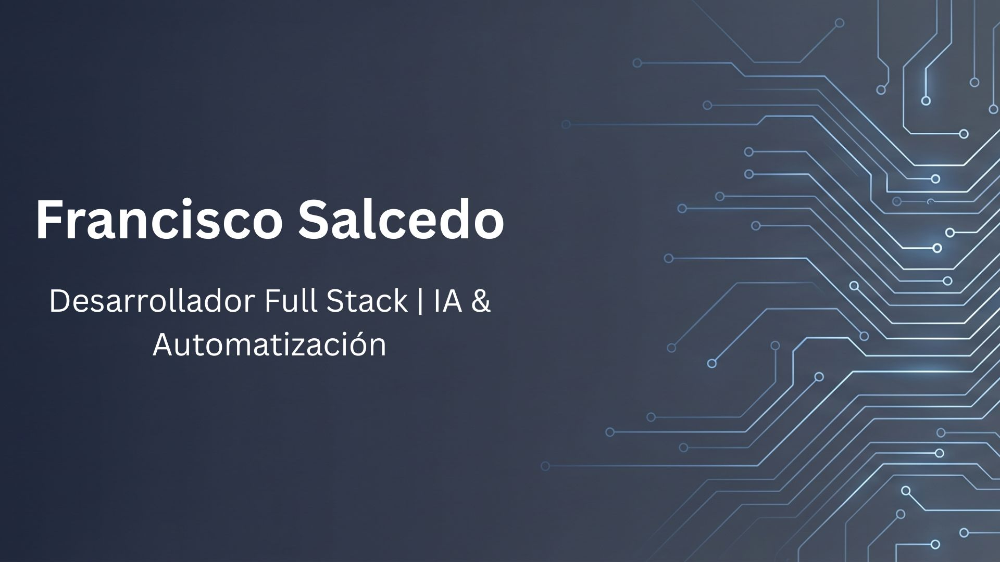

## ¡Hola! Soy Francisco 👋

### 👨🏻‍💻 &nbsp;Sobre mí

🎓 &nbsp;**Estudiante de Ingeniería de Sistemas** en la UNFV (Lima, Perú) — con experiencia real, no solo trabajos de clase.\
💼 &nbsp;~2 años **desarrollando full-stack**, apoyando y construyendo proyectos de principio a fin.\
🛠️ &nbsp;Mi base sólida: **Next.js · React · NestJS · FastAPI · Django**.\
🤖 &nbsp;Ampliándome hacia la **IA aplicada**: ya hice cursos de **LangChain y LangGraph** (agentes, tools, RAG) y desarrollé mi primer producto con un asistente de IA.\
💬 &nbsp;Disponible para **proyectos freelance** y **prácticas pre-profesionales**.\
✉️ &nbsp;Escríbeme a **TU_CORREO@ejemplo.com** — respondo rápido.

  

### 🚀 &nbsp;Proyecto destacado — Asistente de IA (demo en vivo)

Un SaaS multitenant para reservar locales de fiestas, donde un **asistente de IA**
ayuda a encontrar el lugar ideal solo con describir la fiesta, con seguimiento de
leads para los dueños. Hecho con **Next.js + LangChain**. Es el tipo de producto
full-stack que puedo construir y desplegar de punta a punta.

**👉 [Probar el demo en vivo](LINK_A_TU_DEMO)** &nbsp;·&nbsp; **[Ver todos mis proyectos](LINK_A_TU_PORTFOLIO)**

<!--  -->

### 🧰 &nbsp;Lo que he construido

- 🌐 **Apps full-stack completas** — desde la base de datos y la API hasta el frontend
- 📦 **APIs REST de inventario y planillas** con backends limpios y modulares (NestJS / FastAPI)
- 🤖 **Asistente / chatbot con IA** integrado en un SaaS real (LangChain + Next.js)
- 🎓 Proyectos académicos y freelance — aprendo rápido y entrego

### 🌱 &nbsp;Aprendiendo ahora

- ☁️ Estudiando para una **certificación de IA de Microsoft Azure** (agentes / servicios de Azure AI)
- 🤖 Llevando lo aprendido de **LangGraph** (agentes y flujos multi-agente) a producción
- 📚 Profundizando en apps LLM production-grade (RAG, tool calling, evals)

### 🛠 &nbsp;Tecnologías

&nbsp;
&nbsp;
&nbsp;
&nbsp;
\
&nbsp;
&nbsp;
&nbsp;
&nbsp;
&nbsp;
\
&nbsp;
&nbsp;
&nbsp;
&nbsp;

> 
 

### ⚙️ &nbsp;GitHub Analytics

  
  

### 🤝🏻 &nbsp;Conecta conmigo

  
  
  
  

